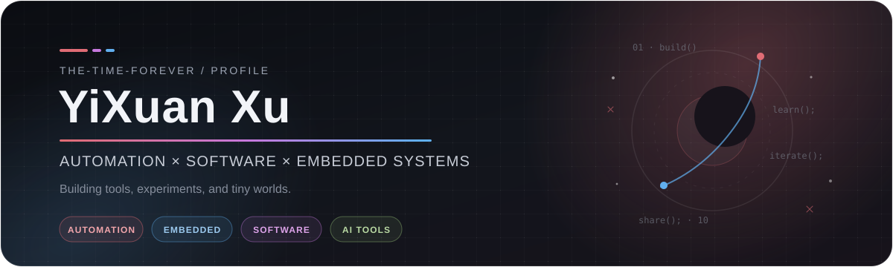

<div align="center">
  
</div>

<br />

<div align="center">

### Hi, I'm YiXuan 👋

**Automation student · AI tool builder · Embedded systems explorer**

I enjoy turning ideas into useful tools — from developer utilities and AI workflows  
to embedded experiments, data projects, and small things that are simply fun to build.

<br />

[](https://the-time-forever.github.io/)
[](https://github.com/The-time-forever)
[](https://github.com/The-time-forever)

</div>

---

## `01.` About me

```text
name       YiXuan Xu
handle     The-time-forever
focus      Automation / Software / Embedded Systems / AI Tools
mindset    learn → build → iterate → share
```

- ⚙️ Interested in **automation, embedded systems, FPGA and computer architecture**
- 🤖 Building and experimenting with **AI developer tools, agents and local workflows**
- 🧪 Enjoy **data analysis, modeling, automation scripts and research tooling**
- 🌐 Maintaining a personal blog for notes, experiments and things worth remembering
- 🌱 Always learning something slightly outside my comfort zone

---

## `02.` Tech stack

<div align="center">
  
</div>

<br />

<div align="center">


</div>

---

## `03.` Featured work

<table>
<tr>
<td width="50%" valign="top">

### 🧭 [RepoWiki Agent](https://github.com/The-time-forever/repowikiagent)

Local-first CLI that turns a source repository into a structured, source-grounded Markdown wiki.

`TypeScript` `CLI` `LLM` `Developer Tools`

</td>
<td width="50%" valign="top">

### ✍️ [Academic Writing Suite](https://github.com/The-time-forever/academic-writing-suite)

A modular skill suite for references, abstracts, paper structure and academic-writing workflows.

`AI Skills` `Academic` `Writing Tools`

</td>
</tr>
<tr>
<td width="50%" valign="top">

### 🐾 [Codex Pets](https://github.com/The-time-forever/Codex-Pets)

A shareable collection of custom Codex pets, assets and installation guides.

`Codex` `Customization` `Community`

</td>
<td width="50%" valign="top">

### 🕷️ [ZZZ Spider](https://github.com/The-time-forever/zzzspider)

A Playwright-based toolkit for collecting Zenless Zone Zero news and official downloadable resources.

`Python` `Playwright` `Automation`

</td>
</tr>
</table>

<div align="center">

**More notes, experiments and projects → [the-time-forever.github.io](https://the-time-forever.github.io/)**

</div>

---

## `04.` Currently exploring

<div align="center">

`Computer Architecture` · `FPGA / HDL` · `Embedded AI` · `LLM Agents` · `Developer Tooling` · `Open Source`

</div>

---

## `05.` GitHub signals

<div align="center">
  
  
</div>

<div align="center">
  
</div>

---

<div align="center">

<sub>「在时间的边缘散步，把路过的想法做成东西。」</sub>

<br />
<br />


</div>
